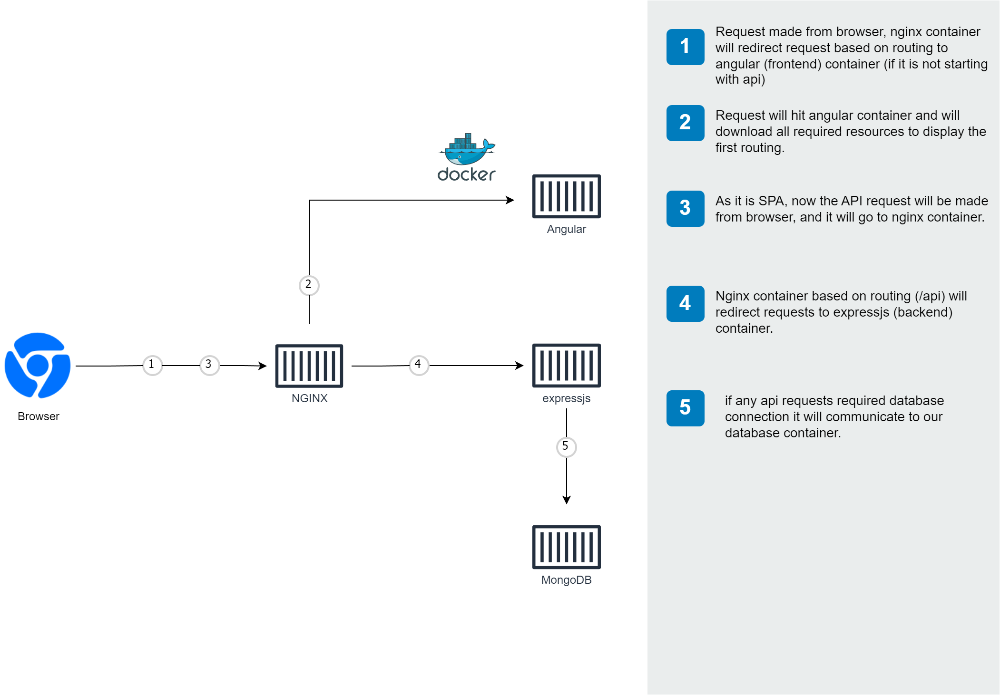

 

# MEAN (Stack) using Docker
- [MEAN (Stack) using Docker](#mean-stack-using-docker)
    - [About (MongoDB - Express - Angular - NodeJS)](#about-mongodb---express---angular---nodejs)
  - [Development server](#development-server)
  - [Build](#build)
  - [Project Folders](#project-folders)
  - [About Project](#about-project)
    - [Built With](#built-with)
      - [Angular (16.2.11)](#angular-16211)
      - [Expressjs (4.17.1)](#expressjs-4171)
      - [Mongo DB](#mongo-db)
      - [NGINX](#nginx)
  - [Getting started](#getting-started)
    - [Using Docker](#using-docker)
      - [Prerequisite](#prerequisite)
      - [Development mode:](#development-mode)
      - [Production mode:](#production-mode)
        - [Using 2 containers (Express (frontend and api) and Mongo)](#using-2-containers-express-frontend-and-api-and-mongo)
        - [Using 4 containers (Mongo,api, angular and nginx)](#using-4-containers-mongoapi-angular-and-nginx)
      - [About Docker Compose File](#about-docker-compose-file)
  - [Further help](#further-help)
      - [Prerequisites](#prerequisites)
      - [Running the Project](#running-the-project)
    - [Without Docker](#without-docker)
      - [Prerequisites](#prerequisites-1)
      - [Running the Project](#running-the-project-1)
  - [Roadmap](#roadmap)
  - [Contributing](#contributing)
  - [License](#license)
  - [Contact](#contact)
<!-- * [Usage](#usage) -->
<!-- * [Acknowledgements](#acknowledgements) -->

### About (MongoDB - Express - Angular - NodeJS)
The **MEAN** stack - consisting of MongoDB, Express, Angular, and NodeJS - forms the foundation of a full-stack web application, and this project serves as an ideal starting point for creating one. The project also demonstrates a feasible approach to operating a live application on **Docker** in both development and production settings. Additionally, it features the use of **[Github actions](#pushing-image-to-registry-github-actions)** to construct and upload images to Docker Hub.

Below is the architecture of the application while it is running.



## Development server

Run `npm start` for a dev server. It will open `http://localhost:4200/` in your default browser. The app will automatically reload if you change any of the source files.

Or you can run `npm run dev-server`. It will start frontend and api together. Open  `http://localhost:4200/` to access application.


## Build

Run `ng build` to build the project. The build artifacts will be stored in the `dist/` directory. Use the `--prod` flag for a production build. Also, we have enabled SSR (Server side rendering) for fast first loading of UI on production.

<!-- ## [Demo](https://youtu.be/ixVxq9k6xVo)
[](https://youtu.be/ixVxq9k6xVo) -->
## Project Folders 
The apps written in the following JavaScript frameworks/libraries:

| folder          | Description                                                                                  |
| --------------- | -------------------------------------------------------------------------------------------- |
| **frontend** | [frontend app using **Angular**](https://github.com/nitin27may/mean-docker/tree/master/frontend)         |
| **api** | [api using **expressjs**](https://github.com/nitin27may/mean-docker/tree/master/api) |
| **loadbalancer** | [load balancer using **nginx**](https://github.com/nitin27may/mean-docker/tree/master/loadbalancer) |
| **mongo** | [mongo db image setup](https://github.com/nitin27may/mean-docker/tree/master/mongo) |

## About Project
The web application presented here is uncomplicated yet functional. It features a user registration and login page that are fully operational, as well as a comprehensive demonstration of **CRUD** (Create, Read, Update, Delete) functionality that incorporates Angular Routing and examples of REST API usage with Express.js. Additionally, the REST services are safeguarded by implementing **JWT** (JSON Web Tokens) for enhanced security.

### Built With
#### Angular (16.2.11)
The frontend of this project is built with Angular, which is represented by the "A" in MEAN stack. To enable Server Side Rendering (SSR), we opted to use the Node.js Alpine image instead of a lightweight Docker image like Nginx to run the Angular application.

The project includes sample code for various functionalities, such as 
- User registration 
- Login
- Profile Management 
- Complete CRUD example for contacts. 

Additionally, there are samples of code for implementing an authentication guard, services, HTTP interceptors, resolvers, and JWT authentication.

This is a simple web application. It has working user registration, login page and there is a complete example of CRUD which contains example for Angular Routing and exprtess js rest api samples.
Also, rest services are secure using JWT. 

For folder structure details refer this link: [Frontend Folder Structure] (/docs/angular-frontend-structure.md)

**[Dockerfile for Production](/frontend/Dockerfile)**
**[Dockerfile for Development](/frontend/debug.dockerfile)**

#### Expressjs (4.17.1)

In MEAN stack, E stands for Expressjs, all rest services are developed using express js.

It contains sample for:

1. Mongo dB connection and schema validation using Mongoose
2. JWT implementation for Authorization
3. API routing
4. User registration & login APIs
5. Complete CRUD example for Contact

For folder structure details refer this link: [API Folder Structure](/docs/expressjs-api-structure.md)

**[Dockerfile for production](/api/Dockerfile)**
**[Dockerfile for development](/api/debug.dockerfile)**

#### Mongo DB

We are using Mongodb for database. MongoDB is a cross-platform document-oriented database program. Classified as a NoSQL database program, MongoDB uses JSON-like documents with optional schemas.

**[Seed data script](/mongo/init-db.d/01.Seed.sh)**
**[Database user creation script](/mongo/init-db.d/02.Users.sh)**

#### NGINX

_Note: only if you are using docker. _

We have uses NGINX loadbalancer in case if there is a requirement that frontend and api need to be exposed on same port.
 For configutration please check [nginx.conf](/loadbalancer/nginx.conf)

**Load balancer (nginx) [Dockerfile](/api/loadbalancer)**

## Getting started

### Using Docker

#### Prerequisite
Install latest [Docker Desktop](https://www.docker.com/products/docker-desktop)

#### Development mode:
  You can start the application in debug mode (database, api and frontend) using docker-compose:

  ```
  git clone https://github.com/nitin27may/mean-docker.git
  cd mean-docker
  
  docker-compose -f 'docker-compose.debug.yml' up
  ```

  It will run fronend `http://localhost:4200` and api on `http://localhost:3000`. you can also access mongodb on port 27017.

  Also, it will automatically refresh (hot reload) your UI for code changes. That is also true for expressjs file changes. 
     
#### Production mode:

  For Production mode, there is 2 options: 
 ##### Using 2 containers (Express (frontend and api) and Mongo)

  ```
    git clone https://github.com/nitin27may/mean-docker.git
    cd mean-docker
    
    docker-compose -f 'docker-compose.yml' up
  ```
  or just run beow as docker consider default file name 'docker-compose.yml'
  ``` 
    docker-compose up
  ```
  It will run fronend and api on `http://localhost:3000`. you can also access mongodb on port 27017
 ##### Using 4 containers (Mongo,api, angular and nginx)
  ```
    git clone https://github.com/nitin27may/mean-docker.git
    cd mean-docker

    docker-compose -f 'docker-compose.nginx.yml' up
  ```
  It will run fronend and api on `http://localhost`. you can aslo access by it's invidual ports. For Frontend `http://localhost:4000` and for api `http://localhost:3000` .you can also access mongodb on port 27017
#### About Docker Compose File
The main focus of this project to show case the possible way to run a real application (Mean stack) using docker.

we have considered 3 scenarios:

1. **Using 2 containers** ([docker-compose.yml](/docker-compose.yml)) 

   
    * express: To host Frontend (Angular) and backend api (expressjs) together
    * database: To host MongoDB 

  _Note: If in above case we are using MongoDB as managed service then we will require only one container._


```dockerfile
# Create image based off of the official Node 10 image
FROM node:16-alpine as builder

# Copy dependency definitions
COPY package.json package-lock.json ./

# disabling ssl for npm for Dev or if you are behind proxy
RUN npm set strict-ssl false

## installing and Storing node modules on a separate layer will prevent unnecessary npm installs at each build
RUN npm ci && mkdir /app && mv ./node_modules ./app

# Change directory so that our commands run inside this new directory
WORKDIR /app

# Get all the code needed to run the app
COPY . /app/

  express: #name of the second service
    build: api # specify the directory of the Dockerfile
    container_name: mean_express
    ports:
      - "3000:3000" #specify ports forewarding
      # Below database enviornment variable for api is helpful when you have to use 
      # database as managed service
    environment:
      - SECRET=Thisismysecret
      - MONGO_DB_USERNAME=admin-user
      - MONGO_DB_PASSWORD=admin-password
      - MONGO_DB_HOST=database
      - MONGO_DB_PORT=
      - MONGO_DB_PARAMETERS=?authSource=admin
      - MONGO_DB_DATABASE=mean-contacts
    links:
      - database

FROM node:14.5-alpine
## From 'builder' copy published folder
COPY --from=builder /app/dist/frontend /app

WORKDIR /app
# Expose the port the app runs in
EXPOSE 4000

CMD ["node", "server/main.js"]

```

## Further help

#### Prerequisites

1. Install latest [Node js ](https://nodejs.org/en/)
2. Install Nodemon as global package (To run exprerssjs in development mode)
   `npm install -g nodemon`
3. Optional (Install Angular CLI
   `npm install -g @angular/cli`)
4. Install Mongodb locally or [Signup](https://www.mongodb.com/atlas-signup-from-mlab?utm_source=mlab.com&utm_medium=referral&utm_campaign=mlab%20signup&utm_content=blue%20sign%20up%20button) for a free managed account
5. Before running the project make sure that you are able to connect MongoDb , you can use [Robo 3T](https://robomongo.org/download) for it

#### Running the Project

Clone the project and run `npm install` in frontend and api folder.

```
  git clone https://github.com/nitin27may/mean-docker.git

  cd mean-docker/frontend

  npm i

  npm start 

  cd mean-docker/api

  npm i

  npm start 

```
For passing enviornment variables (database details) in api, Navigate to api folder, __rename `.env.example` to `.env`__ and update your mongo db details there.

  Also, you can run d `npm run dev-server` from frontend folder to run frontend and api together.

It will run Api on `http://localhost:3000` and frontend on `http://localhost:4200`


Earlier, we were using docker hub autobuild triggers to build images and push to registry (Docker Hub), now it is using github action, we can take an example of frontend image: 
File : 
[angular-build-and-push.yml](/.github/workflows/angular-build-and-push.yml)
```
name: Angular Build
on:
  push:
    branches: master
    paths: 
    - 'frontend/**'

jobs:
  main:
    runs-on: Ubuntu-20.04
    steps:
      -
        name: Checkout
        uses: actions/checkout@v2
      -
        name: Set up QEMU
        uses: docker/setup-qemu-action@v1
      -
        name: Set up Docker Buildx
        uses: docker/setup-buildx-action@v1
      -
        name: Login to DockerHub
        uses: docker/login-action@v1 
        with:
          username: ${{ secrets.DOCKERHUB_USERNAME }}
          password: ${{ secrets.DOCKERHUB_TOKEN }}
      -
        name: Build and push
        id: docker_build
        uses: docker/build-push-action@v2
        with:
          context: frontend/.
          file: frontend/Dockerfile
          push: true
          tags: ${{ secrets.DOCKERHUB_USERNAME }}/mean-angular:latest
          secrets: |
            GIT_AUTH_TOKEN=${{ secrets.MYTOKEN }}
      -
        name: Image digest
        run: echo ${{ steps.docker_build.outputs.digest }}

```

here, DOCKERHUB_USERNAME is your docker hub username and DOCKERHUB_TOKEN,  we can generate from account settings (account settings > Security > New Access Token) section from your docker hub accounts and add under your github repo > settings > secrets 
### Without Docker

#### Prerequisites

1. Install latest [Node js ](https://nodejs.org/en/)
2. Install Nodemon as global package (To run exprerssjs in development mode)
   `npm install -g nodemon`
3. Optional (Install Angular CLI
   `npm install -g @angular/cli`)
4. Install Mongodb locally or [Signup](https://www.mongodb.com/atlas-signup-from-mlab?utm_source=mlab.com&utm_medium=referral&utm_campaign=mlab%20signup&utm_content=blue%20sign%20up%20button) for a free managed account
5. Before running the project make sure that you are able to connect MongoDb , you can use [Robo 3T](https://robomongo.org/download) for it

#### Running the Project

Clone the project and run `npm install` in frontend and api folder.

```
  git clone https://github.com/nitin27may/mean-docker.git

  cd mean-docker/frontend

  npm i

  npm start 

  cd mean-docker/api

  npm i

  npm start 

```
For passing enviornment variables (database details) in api, Navigate to api folder, __rename `.env.example` to `.env`__ and update your mongo db details there.

  Also, you can run d `npm run dev-server` from frontend folder to run frontend and api together.

It will run Api on `http://localhost:3000` and frontend on `http://localhost:4200`


<!-- ## Usage

Use this space to show useful examples of how a project can be used. Additional screenshots, code examples and demos work well in this space. You may also link to more resources.

For more examples, please refer to the [Documentation](https://example.com) -->

## Roadmap

See the [open issues](https://github.com/nitin27may/mean-docker/issues?q=is%3Aissue+is%3Aopen+sort%3Aupdated-desc) for a list of proposed features (and known issues).


<!-- CONTRIBUTING -->
## Contributing

Contributions are what make the open source community such an amazing place to be learn, inspire, and create. Any contributions you make are *greatly appreciated*.

1. Fork the Project
2. Create your Feature Branch (`git checkout -b feature/AmazingFeature`)
3. Commit your Changes (`git commit -m 'Add some AmazingFeature'`)
4. Push to the Branch (`git push origin feature/AmazingFeature`)
5. Open a Pull Request

## License
[MIT](https://github.com/nitin27may/mean-docker/blob/master/LICENSE/)
  ## Contact
  Nitin Singh - [@nitin27may](https://twitter.com/nitin27may) 

<!-- Project Link: [https://github.com/your_username/repo_name](https://github.com/your_username/repo_name)
   -->
  <!-- ## Acknowledgements
* [GitHub Emoji Cheat Sheet](https://www.webpagefx.com/tools/emoji-cheat-sheet)
* [Img Shields](https://shields.io)
* [Choose an Open Source License](https://choosealicense.com)
* [GitHub Pages](https://pages.github.com) -->
