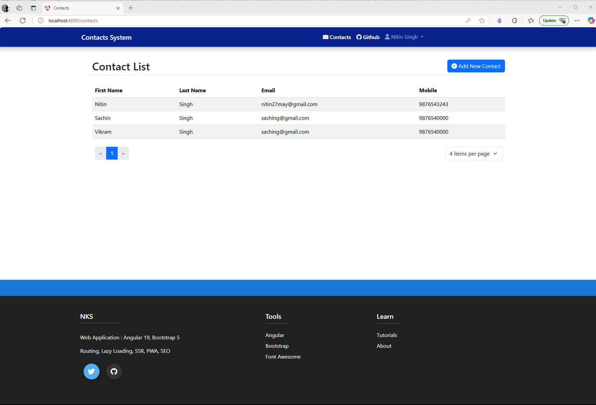
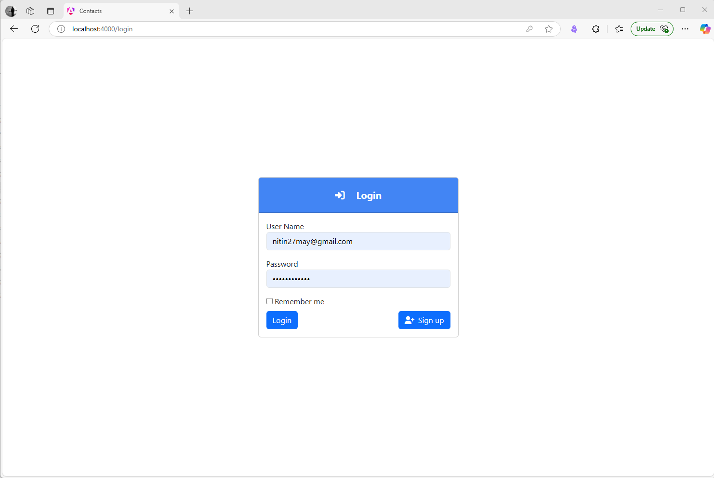

# 📱 MEAN Stack with Docker (Sample Contacts Application)

[](https://github.com/nitin27may/mean-docker/actions)
[](https://github.com/nitin27may/mean-docker/actions)
[](https://github.com/nitin27may/mean-docker/actions)
[](https://github.com/nitin27may/mean-docker/actions)

<p align="center">
  
</p>

A modern, full-stack TypeScript contact management system built with the MEAN stack (MongoDB, Express.js, Angular, Node.js) and containerized with Docker. Perfect for learning full-stack development or as a starting point for your own projects!

## 🌟 What You'll Learn

- **TypeScript** throughout the entire stack
- **Angular 19** with reactive forms, guards, and SSR
- **Express.js** with TypeScript for a robust API
- **MongoDB** integration with Mongoose
- **JWT Authentication** for secure user management
- **Docker** containerization for development and production
- **Nginx** as a load balancer and API gateway
- **CI/CD** with GitHub Actions

## 🚀 Getting Started in 30 Seconds

### Prerequisites

- [Docker](https://www.docker.com/products/docker-desktop) and Docker Compose
- [Git](https://git-scm.com/downloads)

```bash
# Clone the repository
git clone https://github.com/nitin27may/mean-docker.git
cd mean-docker

# Create environment file
cp .env.example .env
# Start the application
docker-compose -f docker-compose.nginx.yml up
```
### API Configuration

The application supports two deployment modes:

1. **Direct API Access**: When using `docker-compose.yml`, the frontend connects directly to the Express API at `http://localhost:3000/api`

2. **Nginx Proxy**: When using `docker-compose.nginx.yml`, the frontend uses a relative path `/api` which Nginx routes to the Express service

This configuration is automatically set during the Docker build process.
That's it! Visit [http://localhost](http://localhost) in your browser.

**Login with:**
- Username: `nitin27may@gmail.com`
- Password: `P@ssword#321`

## 🏗️ System Architecture

<p align="center">
  
</p>

### Single Entry Point Architecture

When using the `docker-compose.nginx.yml` configuration, all traffic flows through a single port (80):

- **Single Exposed Port**: Only port 80 is exposed to the outside world
- **Unified Access Point**: Both UI and API requests enter through Nginx
- **Intelligent Routing**: 
  - Requests to `/api/*` are proxied to the Express.js service
  - All other requests are served by the Angular frontend
- **Simplified Deployment**: No need to manage multiple public endpoints
- **Enhanced Security**: Internal services remain isolated from direct external access

The application uses a microservices architecture with four main components:

1. **Angular Frontend** - Modern UI with TypeScript and Bootstrap 5
2. **Express.js API** - RESTful API with TypeScript and JWT authentication
3. **MongoDB Database** - NoSQL database for flexible data storage
4. **Nginx** - Load balancer and reverse proxy for seamless integration

## 💻 Key Features

### User Authentication

<p align="center">
  
</p>

- JWT-based secure login and registration
- Protected routes with Angular guards
- Token-based API authorization
- Password change functionality

### Contact Management

- Create, read, update, and delete contacts
- Responsive design for mobile and desktop
- Form validation with custom error messages
- Search, sort, and paginate contacts

### Developer Experience

- Hot reloading in development mode
- TypeScript type safety throughout
- Comprehensive error handling
- Swagger API documentation


### Production Mode (3 Containers)

MongoDb, API and UI running on different ports.

```bash
docker-compose up
```

- Api : http://localhost:3000
- UI: 

### Production Mode (4 Containers)

Full microservices architecture with Nginx:

```bash
docker-compose -f docker-compose.nginx.yml up
```

- Application: http://localhost
- MongoDB: localhost:27017

## 📚 Documentation

| Component | Documentation |
|-----------|---------------|
| **[Frontend](/frontend/README.md)** | Angular application with TypeScript |
| **[Backend](/api/README.md)** | Express.js API with TypeScript |
| **[Database](/docs/mongo-readme.md)** | MongoDB configuration and data models |
| **[Load Balancer](/loadbalancer/README.md)** | Nginx configuration and routing |
| **[Local Development](/docs/local-devlopment.md)** | Running without Docker |

## 🗺️ Roadmap

We're constantly improving! Here's what's coming:

### Phase 1: TypeScript Migration (Completed ✅)
- Express.js API fully converted to TypeScript
- Type-safe models and controllers
- Enhanced API documentation with Swagger

### Phase 2: UI Enhancement (Coming Soon)
- Angular Material and Tailwind CSS integration
- Dark/light theme support
- Enhanced mobile experience

### Phase 3: Role-Based Access Control
- Admin, Manager, and User roles
- Permission-based UI components
- Secure API endpoints based on roles

For details, see the [complete roadmap](/docs/roadmap.md).

## 🤝 Contributing

We welcome contributions! Whether you're fixing a bug, improving documentation, or adding a feature, check out our [Contributing Guide](/CONTRIBUTING.md) to get started.

## 📝 Learn More

This project demonstrates several modern web development best practices:

- **TypeScript** for type safety across the stack
- **Angular** reactive forms and component architecture
- **Express.js** middleware and REST API design
- **MongoDB** with Mongoose schemas
- **JWT** authentication flow
- **Docker** containerization and multi-container applications
- **Nginx** reverse proxy configuration

Explore the codebase to learn how these technologies work together in a real-world application!

## 📄 License

This project is licensed under the MIT License - see the [LICENSE](/LICENSE) file for details.

## 🔗 Contact

Nitin Singh - [@nitin27may](https://twitter.com/nitin27may)

Project Link: [https://github.com/nitin27may/mean-docker](https://github.com/nitin27may/mean-docker)
