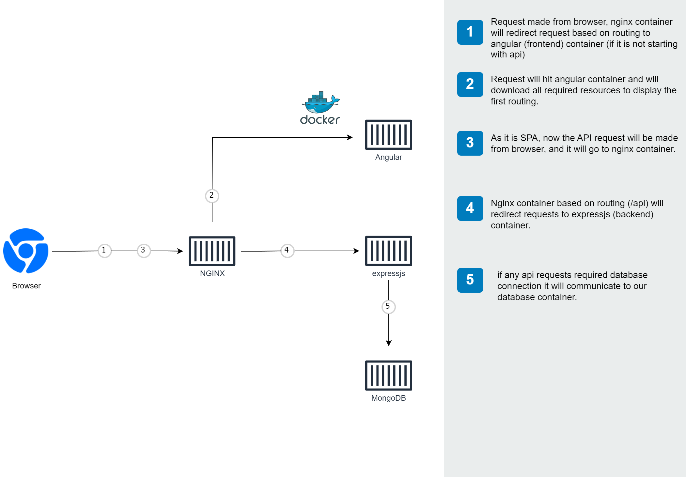

# MEAN Stack Contacts Application

[](https://github.com/nitin27may/mean-docker/actions)
[](https://github.com/nitin27may/mean-docker/actions)
[](https://github.com/nitin27may/mean-docker/actions)
[](https://github.com/nitin27may/mean-docker/actions)

## Overview

This project demonstrates a full MEAN (MongoDB, Express, Angular, Node.js) stack application running with Docker. It features:

- User authentication with JWT
- Contact management system (CRUD operations)
- Responsive UI with Bootstrap 5
- Server-side rendering with Angular Universal
- Containerized with Docker for both development and production
- GitHub Actions for CI/CD

## Demo

[Demo video placeholder - Add your demo video or screenshots here]

## System Architecture



The application consists of four main components, each running in its own container:

1. **Frontend (Angular)**: Provides the user interface
2. **Backend (Express.js)**: Handles API requests and business logic
3. **Database (MongoDB)**: Stores user and contact data
4. **Load Balancer (Nginx)**: Manages traffic between frontend and backend

## Quick Start

### Prerequisites

- [Docker](https://www.docker.com/products/docker-desktop) and Docker Compose
- [Git](https://git-scm.com/downloads)

### Running the Application

Clone the repository:

```bash
git clone https://github.com/nitin27may/mean-docker.git
cd mean-docker
```

Create environment file:

```bash
cp .env.example .env
```

Start the application using Docker Compose:

```bash
docker-compose -f 'docker-compose.nginx.yml' up
```

The application will be available at:
- Frontend + API: http://localhost
- Frontend only: http://localhost:4000
- API only: http://localhost:3000
- MongoDB: localhost:27017

### Default Login Credentials

```
Username: nitin27may@gmail.com
Password: P@ssword#321
```

## Running in Different Modes

### Development Mode

This starts the application with hot reloading for both frontend and backend:

```bash
docker-compose -f 'docker-compose.debug.yml' up
```

- Frontend: http://localhost:4200
- API: http://localhost:3000
- MongoDB: localhost:27017

### Production Mode (2 Containers)

Runs Express.js serving both frontend and API in a single container with MongoDB:

```bash
docker-compose up
```

- Application: http://localhost:3000
- MongoDB: localhost:27017

### Production Mode (4 Containers)

Runs each component in a separate container using Nginx as a load balancer:

```bash
docker-compose -f 'docker-compose.nginx.yml' up
```

- Application: http://localhost
- Frontend: http://localhost:4000
- API: http://localhost:3000
- MongoDB: localhost:27017

## Project Structure

| Directory | Description |
|-----------|-------------|
| **[`/frontend`](./frontend/README.md)** | Angular application |
| **[`/api`](./api/README.md)** | Express.js API |
| **[`/loadbalancer`](./loadbalancer/README.md)** | Nginx configuration |
| **[`/mongo`](./mongo/README.md)** | MongoDB initialization scripts |
| **[`/manifest`](./manifest/)** | Kubernetes deployment files |

For detailed information about each component, see the README in the respective directory.

## Core Features

### Authentication System

- JWT-based authentication
- User registration and login
- Password change functionality
- Route guards for protected pages

### Contact Management

- List all contacts with pagination
- View contact details
- Add new contacts
- Edit existing contacts
- Delete contacts

### Technical Features

- Angular SSR (Server-Side Rendering)
- Responsive design with Bootstrap 5
- Form validation
- MongoDB integration
- RESTful API architecture
- Docker containerization
- GitHub Actions for CI/CD

## Development Guide

For comprehensive development guides, see:

- [Frontend Development Guide](./frontend/README.md)
- [API Development Guide](./api/README.md)
- [Database Guide](./mongo/README.md)
- [Load Balancer Configuration](./loadbalancer/README.md)
- [Deployment Guide](./docs/deployment.md)

## Running Without Docker

See the [Local Development Guide](./docs/local-development.md) for instructions on running the application without Docker.

## Roadmap

For future plans and development priorities, see our [Roadmap](./ROADMAP.md).

## Contributing

We welcome contributions! Please check our [Contributing Guide](CONTRIBUTING.md) for details on how to submit pull requests, report issues, and suggest enhancements.

1. Fork the project
2. Create your feature branch (`git checkout -b feature/amazing-feature`)
3. Commit your changes (`git commit -m 'Add some amazing feature'`)
4. Push to the branch (`git push origin feature/amazing-feature`)
5. Open a Pull Request

## License

This project is licensed under the MIT License - see the [LICENSE](LICENSE) file for details.

## Contact

Nitin Singh - [@nitin27may](https://twitter.com/nitin27may)

Project Link: [https://github.com/nitin27may/mean-docker](https://github.com/nitin27may/mean-docker)