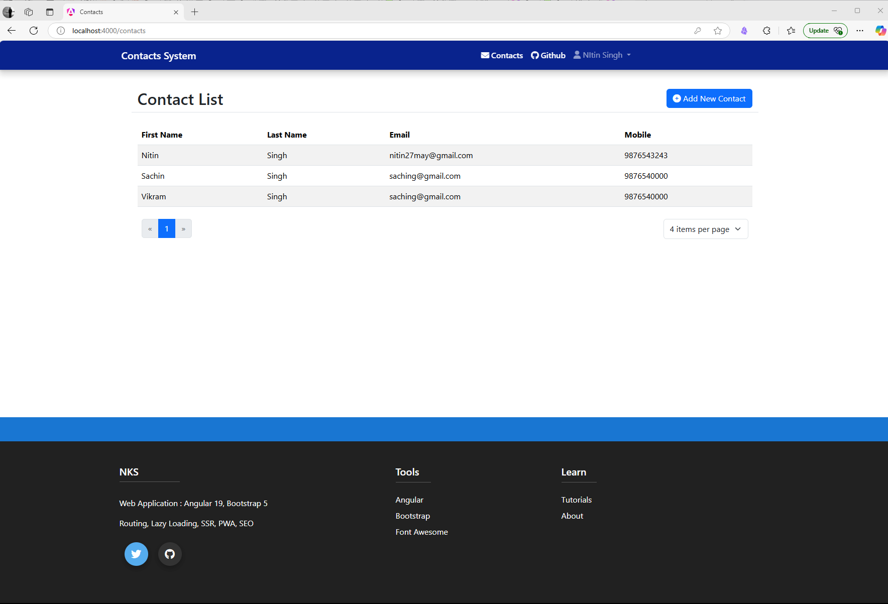
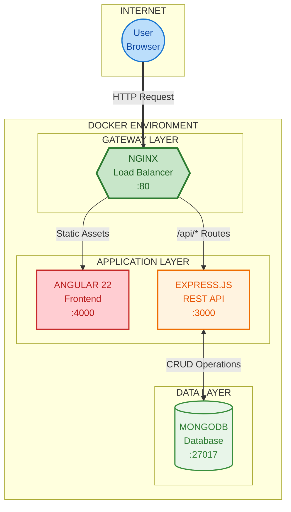

<div align="center">

# MEAN Stack with Docker

### Production-Ready Full-Stack Application

**MongoDB** | **Express.js** | **Angular 22** | **Node.js** | **Docker**

[](https://github.com/nitin27may/mean-docker/actions)
[](https://github.com/nitin27may/mean-docker/actions)
[](https://github.com/nitin27may/mean-docker/actions)

<br/>



<br/>

**A modern, containerized contact management system demonstrating best practices in full-stack TypeScript development**

[Get Started](#getting-started) | [Documentation](https://nitinksingh.com/mean-docker/) | [Report Bug](https://github.com/nitin27may/mean-docker/issues/new?template=bug_report.md)

</div>

---

## Table of Contents

- [Overview](#overview)
- [Architecture](#architecture)
- [Tech Stack](#tech-stack)
- [Getting Started](#getting-started)
- [Deployment Modes](#deployment-modes)
- [Features](#features)
- [Documentation](#documentation)
- [Roadmap](#roadmap)
- [Contributing](#contributing)
- [License](#license)

---

## Overview

> Looking for the .NET equivalent? See
> [clean-architecture-docker-dotnet-angular](https://github.com/nitin27may/clean-architecture-docker-dotnet-angular)
> for the same idea with a .NET API.

This project demonstrates a production-ready MEAN stack application with modern development practices including TypeScript across the entire stack, JWT authentication, and Docker containerization. It serves as both a learning resource and a foundation for building scalable web applications.

### Key Highlights

| Feature | Technology |
|---------|------------|
| Frontend | Angular 22 with TypeScript and Bootstrap 5 |
| Backend | Express.js 5 with TypeScript |
| Database | MongoDB 8.2 with Mongoose 9 |
| Authentication | JWT-based secure authentication |
| Containerization | Docker and Docker Compose |
| Load Balancer | Nginx reverse proxy |
| CI/CD | GitHub Actions |

---

## Architecture

<div align="center">


```mermaid
flowchart TB
    subgraph Internet["INTERNET"]
        direction TB
        client(("User<br/>Browser"))
    end

    subgraph Docker["DOCKER ENVIRONMENT"]
        direction TB
        
        subgraph Gateway["GATEWAY LAYER"]
            nginx{{"NGINX<br/>Load Balancer<br/>:80"}}
        end

        subgraph Services["APPLICATION LAYER"]
            direction LR
            angular["ANGULAR 22<br/>Frontend<br/>:4000"]
            express["EXPRESS.JS<br/>REST API<br/>:3000"]
        end

        subgraph Data["DATA LAYER"]
            mongodb[("MONGODB<br/>Database<br/>:27017")]
        end
    end

    client ==>|"HTTP Request"| nginx
    nginx -->|"Static Assets"| angular
    nginx -->|"/api/* Routes"| express
    express <-->|"CRUD Operations"| mongodb

    classDef internet fill:#e1f5fe,stroke:#01579b,stroke-width:2px,color:#01579b
    classDef gateway fill:#c8e6c9,stroke:#2e7d32,stroke-width:3px,color:#1b5e20
    classDef frontend fill:#ffcdd2,stroke:#c62828,stroke-width:2px,color:#b71c1c
    classDef backend fill:#fff3e0,stroke:#ef6c00,stroke-width:2px,color:#e65100
    classDef database fill:#e8f5e9,stroke:#388e3c,stroke-width:2px,color:#2e7d32
    classDef user fill:#bbdefb,stroke:#1976d2,stroke-width:2px,color:#0d47a1

    class client user
    class nginx gateway
    class angular frontend
    class express backend
    class mongodb database
```

</div>

### How It Works

| Layer | Component | Responsibility |
|:-----:|-----------|----------------|
| **Gateway** | Nginx | Single entry point on port 80. Routes traffic and serves as reverse proxy |
| **Frontend** | Angular 22 | Serves the user interface with reactive components and Bootstrap 5 styling |
| **Backend** | Express.js | Handles API requests, authentication, and business logic |
| **Data** | MongoDB | Persists user accounts and contact information |

### Request Routing

| Request Path | Routed To | Description |
|:-------------|:----------|:------------|
| `/*` | Angular :4000 | Static frontend assets and SPA routes |
| `/api/*` | Express :3000 | REST API endpoints |
| Database | MongoDB :27017 | Data persistence. Not published to the host in the Nginx mode |

---

## Tech Stack

| Layer | Stack |
|:------|:------|
| **Frontend** | Angular 22 (standalone components, signals, zoneless change detection), TypeScript 6, Bootstrap 5, ng-bootstrap, RxJS, router guards |
| **Backend** | Node.js 24, Express 5, TypeScript 6 (strict), Mongoose 9, JWT auth, Helmet, rate limiting |
| **Database** | MongoDB 8.2 with seeded demo data |
| **Tooling** | pnpm 11, ESLint, Vitest (both workspaces) |
| **DevOps** | Docker multi-stage builds, Docker Compose, Nginx, GitHub Actions |

> Versions here are kept in sync with `docs/index.md` and
> `frontend/src/environments/environment.ts`. If they disagree, the code wins —
> please open an issue.

---

## Getting Started

### Prerequisites

- [Docker](https://www.docker.com/get-started/) and Docker Compose
- [Git](https://git-scm.com/downloads)

### Quick Start

```bash
# 1. Clone the repository
git clone https://github.com/nitin27may/mean-docker.git
cd mean-docker

# 2. Create the environment file
cp .env.example .env

# 3. Set a JWT signing key. The API refuses to start on the placeholder value,
#    which is deliberate — the old default was published in this repository.
sed -i "s|^SECRET=.*|SECRET=$(openssl rand -base64 48)|" .env

# 4. Start the application
docker compose -f docker-compose.nginx.yml up --build
```

Open [http://localhost](http://localhost). Nginx is the only published port.

### Fastest start: prebuilt images

Skips the build entirely by pulling the published images from Docker Hub:

```bash
cp .env.example .env
sed -i "s|^SECRET=.*|SECRET=$(openssl rand -base64 48)|" .env
docker compose -f docker-compose.hub.yml up
```

Pin a release with `IMAGE_TAG=2.0.0` instead of tracking `latest`.

### Default Login

```
Username: nitin27may@gmail.com
Password: P@ssword#321
```

---

## Deployment Modes

| Mode | Command | Containers | Published on the host |
|:-----|:--------|:-----------|:----------------------|
| **Development** | `docker compose up --build` | 3 | Frontend `:4000`, API `:3000`, MongoDB `:27017` |
| **Production-shaped** | `docker compose -f docker-compose.nginx.yml up --build` | 4 | `http://localhost` only |
| **Prebuilt images** | `docker compose -f docker-compose.hub.yml up` | 4 | `http://localhost` only |

In the Nginx modes, the Angular, Express and MongoDB containers are reachable
only on the internal network — Nginx is the single entry point.

---

## Features

**Authentication**

- JWT login and registration, with the signing key required at boot
- Protected routes via Angular guards, `Authorization: Bearer` only
- Rate limiting on the authenticate route
- Password change

**Contact management**

- Create, read, update and delete contacts
- Form validation with custom error messages
- Search, sort and paginate
- Responsive layout

<p align="center">
  
</p>

---

## Documentation

| Document | Description |
|:---------|:------------|
| [Frontend](frontend/README.md) | Angular application architecture and components |
| [Backend API](api/README.md) | Express.js endpoints and middleware |
| [Database](docs/mongo-readme.md) | MongoDB schemas and data models |
| [Load Balancer](loadbalancer/README.md) | Nginx routing configuration |
| [Local Development](docs/local-development.md) | Running without Docker |
| [Docker Guide](docs/docker-guide.md) | Container setup and configuration |

---

## Roadmap

Undated on purpose: this repo gets a maintenance pass roughly twice a year, so
a quarterly roadmap lapses faster than it gets updated.

**Planned**

- Role-based access control (admin, manager, user)
- Redis caching on the read paths
- End-to-end tests in CI

**Not planned**

- Server-side rendering. The architecture here is an Nginx-served SPA, and the
  leftover SSR files were removed in the 2026 pass.
- Switching away from Bootstrap.

See [`docs/roadmap.md`](docs/roadmap.md) for detail.

---

## Contributing

Contributions are welcome. Please review our [Contributing Guide](CONTRIBUTING.md) before submitting changes.

- [Report a Bug](https://github.com/nitin27may/mean-docker/issues/new?template=bug_report.md)
- [Request a Feature](https://github.com/nitin27may/mean-docker/issues/new?template=feature_request.md)

---

## License

This project is licensed under the MIT License. See the [LICENSE](LICENSE) file for details.

---

<div align="center">

**Built by [Nitin Singh](https://github.com/nitin27may)**

[](https://twitter.com/nitin27may)
[](https://github.com/nitin27may)

If you find this project useful, please consider giving it a star!

</div>
