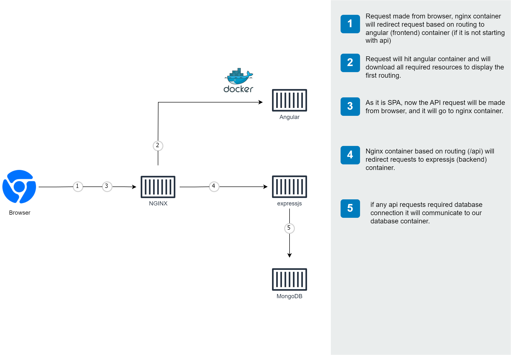

# Architecture
{: .no_toc }

How the containers fit together, and what talks to what.



## Components

| Container | Image | Responsibility |
|---|---|---|
| `nginx` | built from `loadbalancer/` | The gateway. The only container published to the host in production mode |
| `angular` | built from `frontend/` | Nginx serving the compiled Angular bundle. Not a Node server — there is no SSR |
| `express` | built from `api/` | The REST API. Node 24, Express 5, TypeScript |
| `database` | `mongo:8.2` | MongoDB, reachable only from `express` in production mode |

## Deployment Modes

There are three, and they differ only in what is built and what is published:

| Mode | File | Containers | Published to the host |
|---|---|---|---|
| Development | `docker-compose.yml` | 3 (no gateway) | `:4000` frontend, `:3000` API, `:27017` MongoDB |
| Production-shaped | `docker-compose.nginx.yml` | 4 | `http://localhost` only |
| Prebuilt images | `docker-compose.hub.yml` | 4 | `http://localhost` only |

Development mode publishes each service so you can call the API directly with
curl or point a MongoDB client at the database. The other two put everything
behind the gateway, which is what makes the "single entry point" property real
rather than aspirational.

## Request Flow

In the Nginx modes, everything arrives on port 80:

1. The browser requests `http://localhost/`. Nginx proxies it to the `angular`
   container, which returns the SPA shell and its assets.
2. The SPA runs in the browser and calls the API at `/api/...` — the same
   origin, so no CORS is involved.
3. Nginx matches the `/api` prefix and proxies to `express:3000`.
4. Express queries MongoDB over the internal network and returns JSON.

Nginx resolves both upstreams through Docker's DNS on each request rather than
once at startup, so recreating a backend container does not leave the gateway
pointing at an address that no longer exists.

## Two Nginx Configs

They are different files and are easy to confuse:

| File | Listens on | Role |
|---|---|---|
| `loadbalancer/nginx.conf` | 8080 | The gateway: routes `/api` to Express, everything else to the frontend |
| `frontend/nginx.conf` | 4000 | Inside the Angular image: serves static files with an SPA fallback to `index.html` |

Both containers run as an unprivileged user, which is why the gateway listens on
8080 rather than 80 — binding a port below 1024 as a non-root user needs an
extra capability. Compose publishes `80:8080`, so nothing changes for the user.

## Startup Order

Containers do not start in an arbitrary order. Each service declares a
healthcheck, and `depends_on` waits on it:

```
database (mongosh ping) -> express (GET /health) -> angular (GET /) -> nginx
```

Express also waits for its own MongoDB connection before it begins listening, so
a container reporting healthy is one that can actually serve a request.
